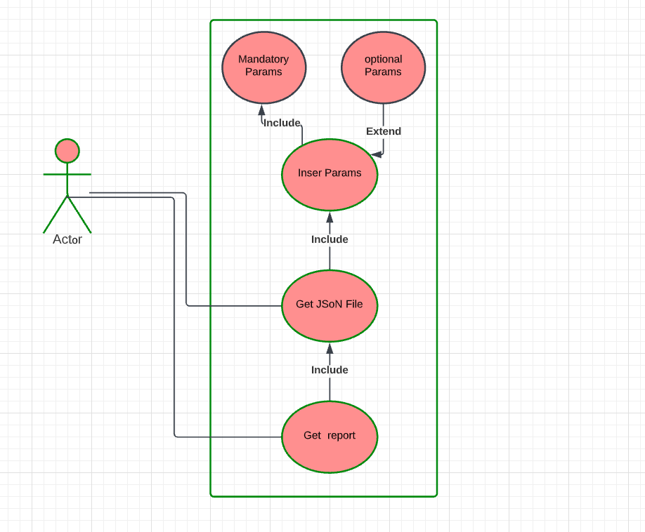
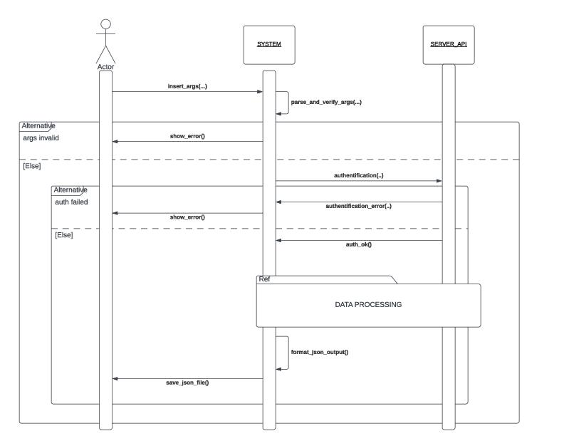
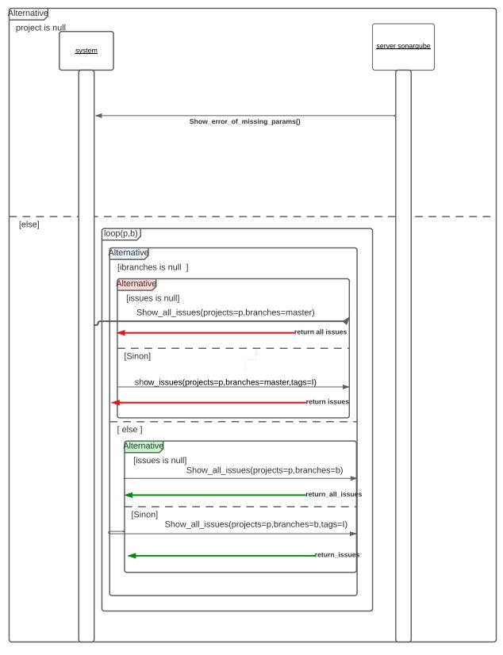

# sonarqube_report
## python script to generate reports in python from the SonarQube server
---
## HOW TO USE THE SCRIPT:

### install the sonarqube library : 

##### pip install sonarqube
---
### generel overview

##### Use Case diagram :
the Main Functionalities of the project is :

##### Sequence diagram : 

the general idea of how the script works is : 

The sequence diagram of Data processing part is : 

